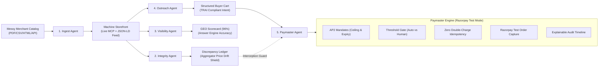

# ⚡ Storefront for Machines

> **AI-Native Commerce Infrastructure & Agentic Payment Protocol**  
> *Track: AI Growth & Agentic Commerce (Razorpay Test Mode Integration)*

---

## 🎯 Thesis

Merchants spent twenty years optimizing catalogs for human eyes. **The next buyer doesn't have eyes.**

A typical merchant storefront today is:
1. **Unreadable to an agent**
2. **Invisible to answer engines**
3. **Described wrongly across half the web**
4. **Impossible to transact with programmatically**

**Storefront for Machines** fixes all four in order, and the last one is where money moves.

---

## 🏗️ 5-Agent Architecture Pipeline



---

## 🤖 The 5 Specialized Agents

### 1. Ingest Agent (`/api/merchant/upload-catalog` & `/api/mcp/tools`)
- **Inputs**: PDFs, messy CSVs, unstructured text, legacy HTML tables, or Shopify exports.
- **Normalizes**: Extracts pricing, stock levels, and generates canonical Product IDs and variant trees.
- **Emits**: Live JSON-LD feeds (`/api/storefront/:merchant_id/feed`) and real Model Context Protocol (MCP) server endpoints.
- **MCP Tools Exposed**:
  - `list_catalog`: Filter catalog by category and budget.
  - `get_product_schema`: Returns canonical schema and AP2 purchase metadata.
  - `check_stock`: Live stock and max order quantity.
  - `validate_order_quote`: Verifies pricing, calculates tax, and returns bounded quotes.

### 2. Integrity Agent (`/api/integrity/scan`)
- **Monitors**: External aggregators (Amazon, Flipkart, Google Shopping, Swiggy Instamart) for stale listings, outdated prices, or discontinued SKUs.
- **Discrepancy Ledger**: Captures SKU drift, confidence scores, and automated remediation actions.
- **Paymaster Hook**: Triggers the signature failure demo (**Price drift caught mid-checkout**).

### 3. Visibility Agent (`/api/visibility/report`)
- **Generative Engine Optimization (GEO)**: Tests buyer intent queries against Perplexity, ChatGPT Search, Claude 3.7 Sonnet, and Gemini.
- **4 Key Metrics**: Brand Visibility Score, Product Accuracy Score, Citation Score, Trust Score.
- **1-Click Remediation**: Pushes canonical semantic vectors and JSON-LD feeds to boost GEO score from 58% to 96%.

### 4. Outreach Agent (`/api/cart/create`)
- **Inbound Signal Qualifier**: Translates natural language shopping prompts into structured Buyer Intent Objects.
- **Compliance**: Strict TRAI commercial communication rules, consent logging, and zero spam calling.

### 5. Paymaster Agent (`/api/payment/create` on Razorpay Test APIs)
- **Mandate (AP2 Spec)**: Signed authorizations (`max_per_tx`, `daily_limit`, `allowed_categories`, `expiry_time`). Enforced in code, not prompts.
- **Threshold Gate**: Transactions `<= ₹2,000` execute autonomously; `> ₹2,000` escalate to the Human Gatekeeper Approval Drawer.
- **Idempotency**: Client-supplied `Idempotency-Key` prevents double charging on network retries.
- **Explainable Audit Timeline**: Plain-English breakdown for every rupee ("Why ₹4,200 left an account").

---

## 🎪 The 5 Signature Demo Scenarios

| # | Demo Scenario | Key Flow | Output |
|---|---|---|---|
| **01** | **Autonomous Purchase** | Amount ₹850 `<= ₹2,000` Gate, AP2 Mandate verified | Instant Razorpay Test order created & captured |
| **02** | **Signature Failure Demo: Price Drift Caught Mid-Checkout** | Integrity Agent detects Amazon price drift during checkout | Paymaster halts before authorization; zero rupees charged; audit logged |
| **03** | **Human Gatekeeper Approval** | Order ₹6,050 `> ₹2,000` threshold | Live modal drawer triggers with 120s countdown and 1-click authorize |
| **04** | **Mandate Exhaustion** | Spending ₹12,600 exceeds remaining daily cap | Clean programmatic refusal in code |
| **05** | **Idempotent Network Retry** | Re-sends duplicate request with identical key | Returns cached receipt with zero duplicate charges |

---

## 🚀 Quick Start

### 1. Install Dependencies
```bash
npm install
```

### 2. Start Fullstack Dev Server (Backend + Vite Client)
```bash
npm run dev
```

- **Frontend App**: `http://localhost:5173`
- **Backend API**: `http://localhost:3001`
- **MCP Server Endpoint**: `http://localhost:3001/api/mcp/tools`
- **Machine Product Feed**: `http://localhost:3001/api/storefront/merchant-subko-001/feed`

---

## 🐳 Docker Deployment

```bash
docker-compose up --build
```
